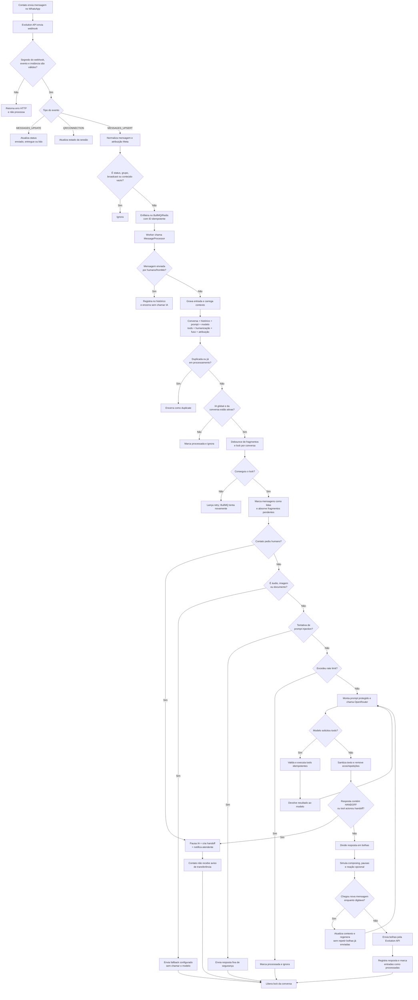
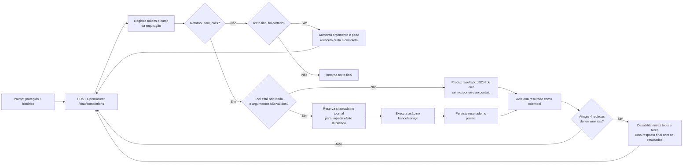
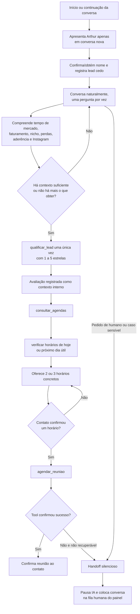
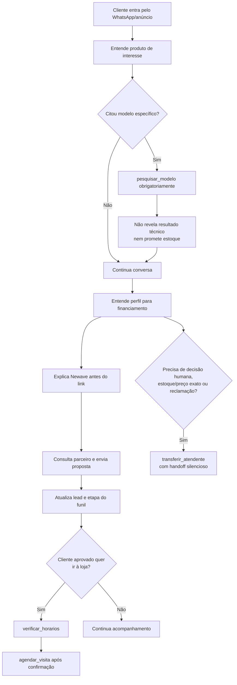

# Fluxograma do fluxo atual da IA

> Mapeamento do código em 15/07/2026. Este documento descreve o que o backend executa hoje, não apenas o fluxo idealizado nos arquivos de instrução.

## Visão geral

O AtendON tem um único motor técnico de atendimento. Cada workspace fornece ao motor seu próprio prompt, modelo, provedor, chave OpenRouter, configuração de humanização e lista de ferramentas habilitadas. Por isso, Meta Cell e Newave percorrem a mesma infraestrutura, mas executam fluxos comerciais diferentes.

## O que a IA recebe em cada chamada

Antes de chamar a OpenRouter, o backend combina:

1. uma política fixa de segurança, continuidade, tom, uso de ferramentas e handoff silencioso;
2. o prompt comercial configurado no workspace;
3. o nome do perfil do WhatsApp, marcado como dado não confiável;
4. data, hora e fuso do workspace;
5. até 100 mensagens recentes, limitadas a 24 mil caracteres;
6. somente as ferramentas habilitadas para aquele agente.

A política fixa é colocada ao redor do prompt do tenant por `protectedSystemPrompt`. Portanto, em caso de conflito, o comportamento protegido do backend é o efetivo. Um exemplo importante: o arquivo antigo da Meta Cell contém exemplos avisando que chamará alguém da equipe, mas o runtime atual exige handoff silencioso e suprime qualquer texto visível ao contato.

## Loop interno da OpenRouter e das ferramentas

As ações disponíveis no conjunto completo são:

- cadastro e funil: `registrar_lead`, `atualizar_status_lead`, `qualificar_lead`;
- consultas: `consultar_categorias`, `consultar_parceiros`, `consultar_unidades`, `consultar_agendas`;
- agenda: consultar horários, agendar, reagendar e cancelar visita ou reunião;
- proposta: `enviar_proposta_parceiro`;
- verificação externa: `pesquisar_modelo`, usando uma chamada OpenRouter separada com plugin de busca web;
- atendimento humano: `transferir_atendente`.

Nem todo agente recebe todas elas. A lista vem de `agent_configs.enabled_tools` e é verificada novamente pelo executor antes de qualquer ação.

## Fluxo comercial do workspace Newave

Regras de negócio reforçadas pelo servidor:

- reunião pode ser criada para qualquer lead com qualificação registrada, de 1 a 5 estrelas;
- nota, justificativa, status técnico e nomes de ferramentas nunca são mostrados ao contato;
- avaliações de 1–2 estrelas continuam registradas como contexto e também seguem para oferta de horários;
- cadastro, qualificação e agendamento são protegidos contra repetição pelo journal de tool calls.

## Fluxo comercial do workspace Meta Cell

## Tratamento de concorrência, duplicidade e falhas

- O job da entrada usa tenant, sessão e ID externo como identificador; reentregas iguais não criam outro job efetivo.
- A mensagem também possui chave única no PostgreSQL e uma lease de processamento.
- Apenas um turno de IA por conversa pode passar do lock Redis ao mesmo tempo; o lock é renovado durante respostas longas.
- Fragmentos enviados em sequência são agrupados por debounce.
- Uma mensagem nova durante o `composing` faz a resposta ser regenerada com o contexto atualizado.
- Tool calls possuem journal por mensagem e ordinal, evitando repetir efeitos como cadastro ou agendamento durante retries.
- O worker tenta a entrada até 5 vezes com backoff exponencial. Depois do esgotamento, cria um alerta de sistema.
- Notificações de handoff usam outbox/fila própria e um reconciliador periódico, para não perder a notificação ao atendente.

## Arquivos que implementam o fluxo

| Responsabilidade | Arquivo |
|---|---|
| Receber e validar webhook | `apps/backend/src/app.ts` |
| Converter payload Evolution em mensagem interna | `apps/backend/src/modules/whatsapp/evolution-webhook.ts` |
| Fila de entrada | `apps/backend/src/queue/message-queue.ts` |
| Workers de IA, humano e handoff | `apps/backend/src/worker.ts` |
| Montagem do runtime | `apps/backend/src/runtime.ts` |
| Orquestração principal do turno | `apps/backend/src/modules/messages/process-message.ts` |
| Persistência, contexto, histórico e idempotência | `apps/backend/src/modules/messages/repository.ts` |
| Política protegida e bloqueio de injection | `apps/backend/src/modules/ai-router/prompt-guard.ts` |
| Cliente OpenRouter e loop de tools | `apps/backend/src/modules/ai-router/openrouter.ts` |
| Catálogo de ferramentas | `apps/backend/src/modules/ai-router/tools.ts` |
| Validação e execução das ferramentas | `apps/backend/src/modules/ai-router/tool-executor.ts` |
| Regras de agenda, lead e qualificação | `apps/backend/src/modules/scheduling/service.ts` |
| Humanização, debounce e lock | `apps/backend/src/modules/messages/humanizer.ts` |
| Prompt comercial Meta Cell | `instrução-ia.md` |
| Prompt comercial Newave | `instrução-newave-ia.md` |

## Resumo em uma frase

A IA recebe a conversa já persistida e protegida, decide entre responder ou executar ações controladas, pode iterar com ferramentas até produzir uma resposta final, envia essa resposta de forma humanizada e idempotente e, quando não deve continuar, pausa silenciosamente a conversa para atendimento humano.
